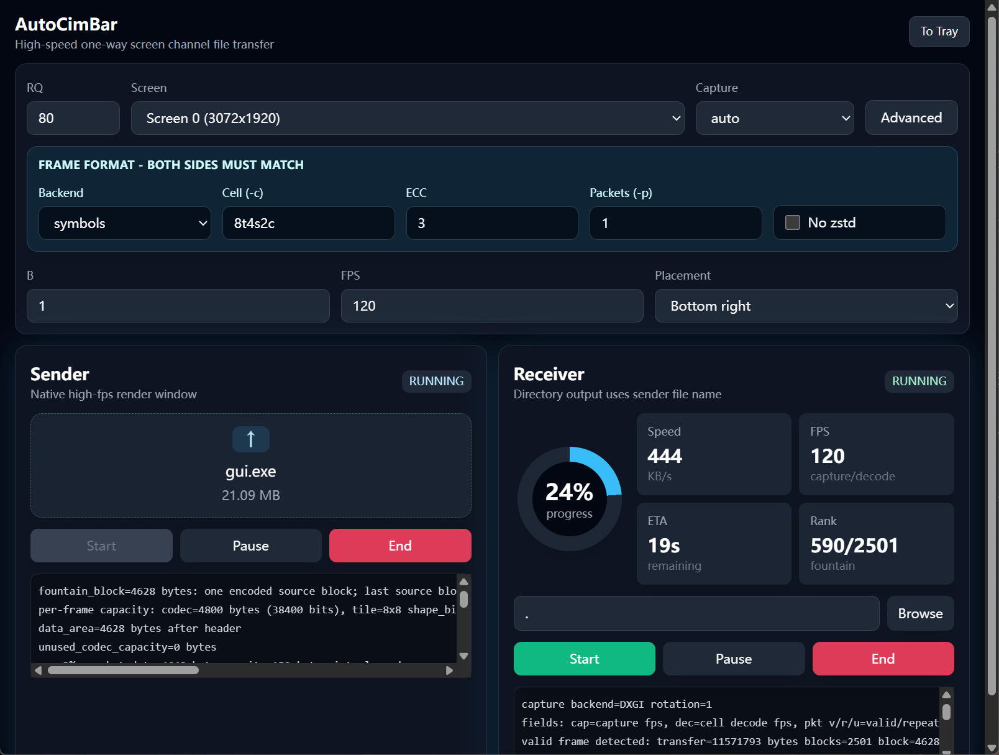

# AutoCimBar



AutoCimBar 是一个利用远程桌面（或串流画面）的屏幕信道，进行单向文件传输的工具。encoder 把文件编码成屏幕上的高密度彩色符号帧（参考 [cimbar](https://github.com/sz3/cimbar)），decoder 从指定屏幕区域截图并恢复文件。采用喷泉码、ECC 等技术，实现高效的数据传输，目前实测已经突破了梦寐以求的 1MB/s 大关。

[English README](README.en.md)

## 文档导航

- [文档索引](doc/README.md)：按用户指南、性能分析、实现笔记、研究资料和历史归档组织。
- [性能优化总览](doc/performance/overview.md)：encoder/decoder、ECC、packets、zstd、MD5 等优化记录。
- [Decoder pipeline 与指标](doc/performance/decoder-pipeline.md)：`cap`、`dec`、`pkt v/r/u`、`-v` 诊断指标的准确含义。
- [DXGI 截图后端](doc/performance/dxgi-capture.md)：DXGI/GDI 后端差异、HDR 限制和旋转屏处理。

## 实验结果

以下为当前 RDP 远程实测结果：

- `-c 4t4s8c` （`-Q 130` 时，`-packets 8`）
- 有效解码 fps 只有最高 30 fps（远程桌面限制）

| -Q  | speed       |
| --- | ----------- |
| 14  | 33 KB/s     |
| 20  | 61 KB/s     |
| 26  | 114 KB/s    |
| 130 | 1310.4 KB/s |

moonlight 由于传输的是视频流和 RDP 本地渲染画面有较大差别，从画面中提取数据更加困难，目前 60fps 下可以实现 243 KB/s 的速度。

## 功能概览

- 默认 zstd 压缩源文件，decoder 流式解压并校验文件 MD5
- 每个 packet 内置 CRC，能尽早丢弃无 ECC 或低 ECC 下的错误 packet
- 单帧 Reed-Solomon ECC，支持交织，适合 GPU 编码/串流压缩造成的局部错误
- 线性喷泉码，支持丢帧、重复帧和冗余帧
- Windows encoder 使用原生无边框置顶窗口，不需要浏览器
- 常用 tile 符号集已编译进程序，单 exe 分发即可运行
- 新增 `-backend qr`，可用标准 QR code backend 和 symbols backend 做速度对比
- 支持从 `~/.autocambar.ini` 读取 INI 配置，命令行参数会覆盖配置文件

## 编译

Linux/macOS:

```bash
export PATH=/usr/local/go/bin:$PATH
go test ./...
go build -o bin/encoder ./cmd/encoder
go build -o bin/decoder ./cmd/decoder
go build -o bin/tilegen ./cmd/tilegen
```

Linux/macOS 交叉编译 Windows:

```bash
GOOS=windows GOARCH=amd64 go build -o bin/encoder.exe ./cmd/encoder
GOOS=windows GOARCH=amd64 go build -o bin/decoder.exe ./cmd/decoder
```

GUI 程序（Windows）:

```bash
cd cmd/gui/frontend
npm install
npm run build
cd ../../..
GOOS=windows GOARCH=amd64 go build -ldflags="-H windowsgui" -o bin/gui.exe ./cmd/gui
```

## 快速使用

屏幕传输命令：

```bash
./bin/encoder -i input.bin -RQ 120 -r 0
./bin/decoder -RQ 120 -r 1
```

PNG 离线验证：

```bash
./bin/encoder -png -i input.bin -o frames -RQ 80
./bin/decoder -png -i frames -RQ 80
```

encoder 会把原始文件名作为一次性源数据元信息发送。decoder 默认输出到当前目录，并使用发送端文件名保存；如果 `-o` 指向一个目录，也会在该目录下使用发送端文件名。只有当 `-o` 指向具体文件路径时，才会强制使用该路径。

Windows GUI:

```bash
./bin/gui.exe
./bin/guilite.exe
```

GUI 提供 Sender 和 Receiver 两个 tab，可以同时发送和接收；二维码/符号显示仍沿用原生 Windows 高性能置顶窗口。GUI 会读取 `~/.autocambar.ini` 的 `[default]` 和 `[gui]` 配置。内置 profile 为 `tiny`（约 7 KB/s，低带宽）、`lite`（约 30 KB/s，默认）和 `ultra`（高吞吐）；也可在 `[profile.NAME]` 中定义自定义 profile。点击窗口 `X` 会退出程序；点击 `To Tray` 会最小化到系统托盘，托盘菜单可显示或退出程序。

`guilite.exe` 是简化版 GUI，仍包含 Sender 和 Receiver，只保留 `RQ`、屏幕、位置和 `B`。其它参数固定为 `capture=gdi`、`cell=8t4s2c`、`ecc=3`、`packets=1`、启用 zstd、`fps=30`，`RQ` 最大为 40，默认 26。

## 关键参数

帧格式参数，encoder 和 decoder 必须一致：

```text
-backend        symbols 或 qr，默认 symbols
-c, -cell       紧凑 cell 规格，默认 8t4s2c
-ecc            单帧 Reed-Solomon ECC 百分比，默认 3
-p, -packets    每帧独立 packet 数
-no-zstd        encoder 关闭默认 zstd 压缩；decoder 从源数据头自动识别
```

运行参数：

```text
-i              输入文件；decoder PNG 模式下为帧目录
-o              输出路径；encoder PNG 模式下为帧目录；decoder 默认当前目录，目录输出时使用发送端文件名
-RQ             以 8x8 tile 为基准的参考 Q，tile 变小时自动增大实际 Q
-Q              原始 grid/cell 数；设置 RQ 时优先使用 RQ
-B              cell 缩放倍数
-f, -fps        播放或截图帧率，默认 120
-r, -R          屏幕区域，格式 SCREEN、X:Y 或 SCREEN:X:Y
-png            使用 PNG 帧模式；默认是屏幕模式
-list-displays  查看屏幕编号和范围
```

decoder 截图后端参数：

```text
-capture-backend auto|dxgi|gdi，默认 auto。DXGI 速度最高，但 HDR/系统颜色管理可能破坏高 color-bit 模式；遇到颜色识别失败时请使用 SDR 屏幕或切到 gdi。
-debug-capture   指定目录，保存前 60 张截图为 <cell>_NNN.png；目录不存在会自动创建
-symbols        外部 symbol PNG 目录；为空时使用内置符号
```

区域参数：

- `-r 0`：屏幕 0，默认右下角
- `-r 1`：屏幕 1，默认右下角
- `-r 1:c:c`：屏幕 1 居中
- `-r c:c`：屏幕 0 居中
- `-r 1:100:200`：屏幕 1 的 `(100, 200)`

查看屏幕编号：

```bash
./bin/encoder -list-displays
./bin/decoder -list-displays
```

## Cell 和 Tile

### 远程桌面自动缩放

当云桌面为 1080p、本地屏幕为 4K，或远程客户端缩放画面时，可以让发送图案居中，并在接收端启用自动缩放识别：

```bash
./bin/encoder.exe -i input.bin -RQ 80 -r 0 -auto-scale
./bin/decoder.exe -RQ 80 -r 1 -auto-scale
```

两端仍使用相同的逻辑 `Q/RQ`、cell、ECC、packets 和符号集；不需要手动把接收端 RQ 乘以缩放倍数。decoder 从 `-r` 选定的整块屏幕搜索居中的等比例符号图案，CRC 校验通过后锁定尺寸；连续校验失败时重新搜索。开启后忽略接收端 `X:Y`。

GUI 完整版在 Capture 下提供 **Auto scale (sender + receiver)** 开关。两端均开启后，发送端自动设置 Center，接收端自动搜索所选整屏并识别缩放，无需手动调 Placement 或按分辨率修改 RQ。INI 的 `[encoder]`、`[decoder]` 或 `[gui]` 中可写 `auto-scale = true`。默认关闭，GUI Lite 不提供此开关。

自动缩放模式保留用户设置的发送和接收 FPS，不自动降帧或限制发送帧率。日志会区分几何失锁和几何稳定但 packet 校验失败。

此模式目前只支持 symbols 和屏幕模式。远程桌面应全屏显示，让传输图案位于本地屏幕中心；不支持任意窗口位置、透视或非等比例拉伸。缩小后每个逻辑 tile 像素至少需要一个屏幕像素，严重缩小或高颜色位经插值后仍可能丢失信息。建议先用默认 `8t4s2c`，必要时增大发送端 `B`。整屏截图与重采样有额外开销；[实现与测试说明](doc/implementation/auto-scale.md)记录了支持范围和诊断方式。

### Cell 规格

默认 `-c 8t4s2c` 等价于：

```text
-tile 8x8 -shape-bits 4 -color-bits 2
```

`-cell` 语法：

- `8t` 表示 `-tile 8x8`
- `4s` 表示 `-shape-bits 4`
- `2c` 表示 `-color-bits 2`

高吞吐实验仍可手动指定 `-c 4t4s8c`。

生成新符号：

```bash
./bin/tilegen -tile 8x8 -shape-bits 6 -o generated-tiles/8x8_6bit_custom -seed 123 -attempts 20000
```

使用外部符号目录时，encoder 和 decoder 必须指定相同 `-symbols`、`-tile` 和 `-shape-bits`。

## 配置文件

程序启动时会读取 `~/.autocambar.ini`。配置文件是 INI 格式，支持无 section、`[default]`、`[encoder]` 和 `[decoder]`。GUI 还支持 `[profile.NAME]`；命令行显式参数会覆盖配置文件。

示例：

```ini
[default]
RQ = 120
B = 1
ecc = 3
cell = 8t4s2c
fps = 120

[encoder]
r = 0

[decoder]
r = 1
capture-backend = auto

[profile.work]
profile-description = stable office link
RQ = 80
cell = 8t4s2c
ecc = 5
packets = 1
```

配置 key 使用命令行参数名即可，例如 `RQ`、`cell`、`packets`、`capture-backend`；下划线会按短横线处理。

## QR backend 的 -Q 含义

symbols backend 下，`-Q` 表示每边 cell 个数；默认 cell 是 `8x8` tile 时，图像宽度约为 `Q * 8 * B` 像素。

QR backend 下，`-Q` 会映射到最接近的 QR version。QR 的真实模块数必须满足标准公式 `17 + 4 * version`，并且图像周围还有 quiet zone，所以它和 symbols backend 不是完全相同的 cell 个数。当前实现会按 `8x8` 参考 tile 缩放 QR 模块，让相同 `-Q` 下的显示面积更接近，但 QR 仍会因为 version 取整和 quiet zone 有尺寸差异。

## decode 输出

decoder 每秒追加一行日志，方便保存后分析：

```text
fields: cap=capture fps, dec=decoder-consumed fps, pkt v/r/u=valid/repeat-or-same/useful packet fps, bad=invalid packet fps, spd=current KB/s, ema=smoothed KB/s
```

含义：

- `cap`：截图 FPS
- `dec`：decoder 消费截图的 FPS，包含真实 cell decode 和相同截图跳过
- `pkt v/r/u`：有效 packet / 重复 packet 或相同截图跳过 / 实际提升喷泉码 rank 的 useful packet
- `bad`：CRC、ECC、参数或解析失败的 packet
- `spd`：当前窗口速度
- `ema`：近期滑动速度

使用 `-v` 时，`dec_ms` 仍只统计真实 cell decode 的平均耗时，不包含相同截图跳过。

完成后 decoder 会输出 summary，总时间从首个有效帧开始计算，不包含等待 encoder 启动的时间。

## 自动测试

```bash
go test ./...
```

测试覆盖 PNG 端到端、QR backend PNG 往返、ECC、packet CRC、喷泉码、zstd/MD5、动态 tile 符号集和 screen frame source。

## 当前限制

- 当前喷泉码是线性 XOR 方案，decoder 需要通过每帧中的 transfer size 推导 blockCount。
- `Q/RQ`、`B`、`-ecc`、`-c`、`-packets`、`-backend` 等参数是运行时约定，不写入每帧数据。
- `-backend qr` 用于对比，不是当前最高吞吐路径；最高吞吐路径仍是 symbols backend。
- 非 Windows 平台 encoder screen 模式使用 HTTP/浏览器 fallback。

## Credits

- https://github.com/sz3/libcimbar

## License

MIT

### GUI 校验值与日志

点击 Start 后后台计算发送文件的 MD5，计算完成即更新界面，无需等发送结束。两端日志的 Pop out 可打开独立窗口；Clear 清空当前视图，Pause logs 只暂停显示，传输继续。Resume logs 补上最近 2000 条保留记录，Follow 控制自动滚动。
